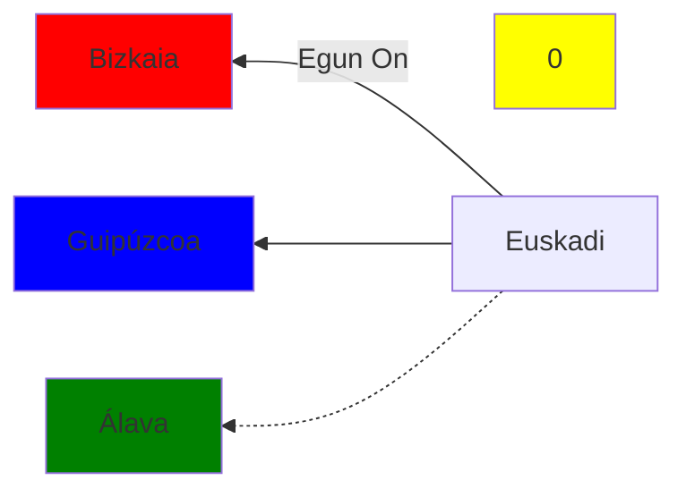
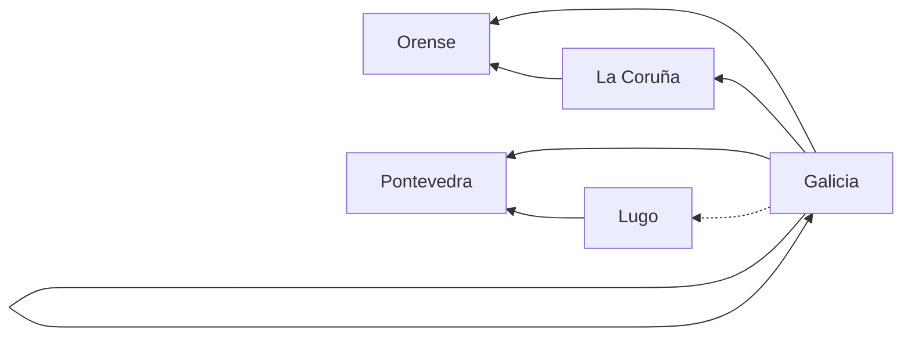
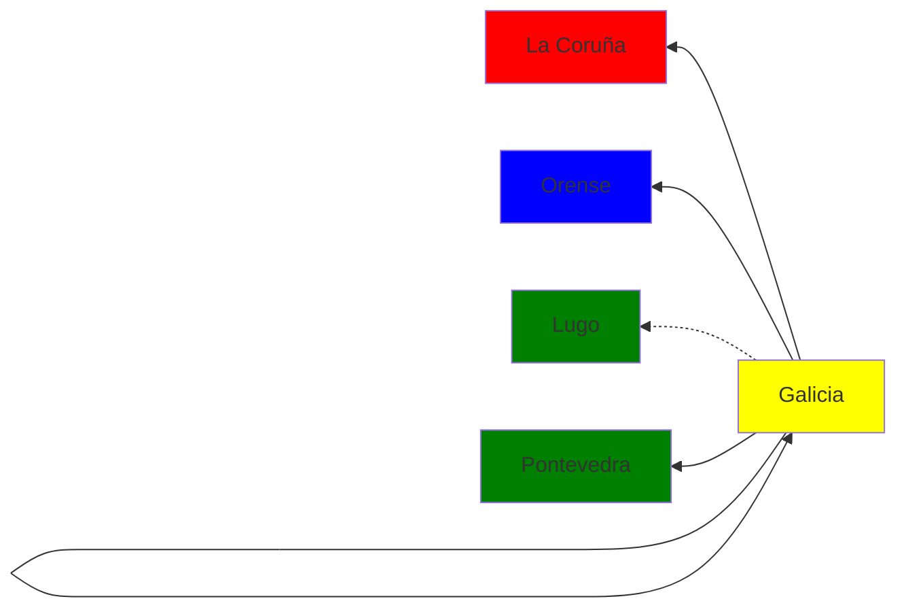
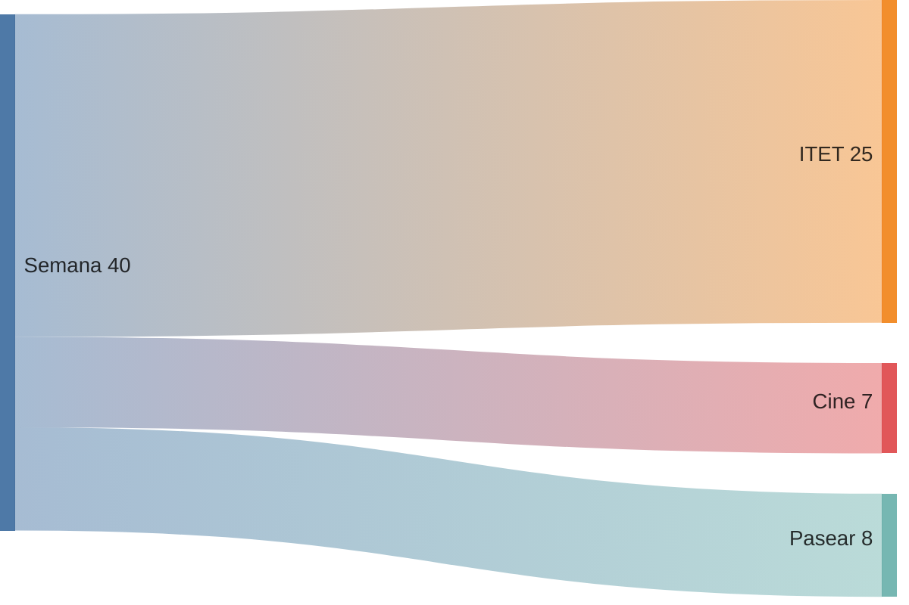
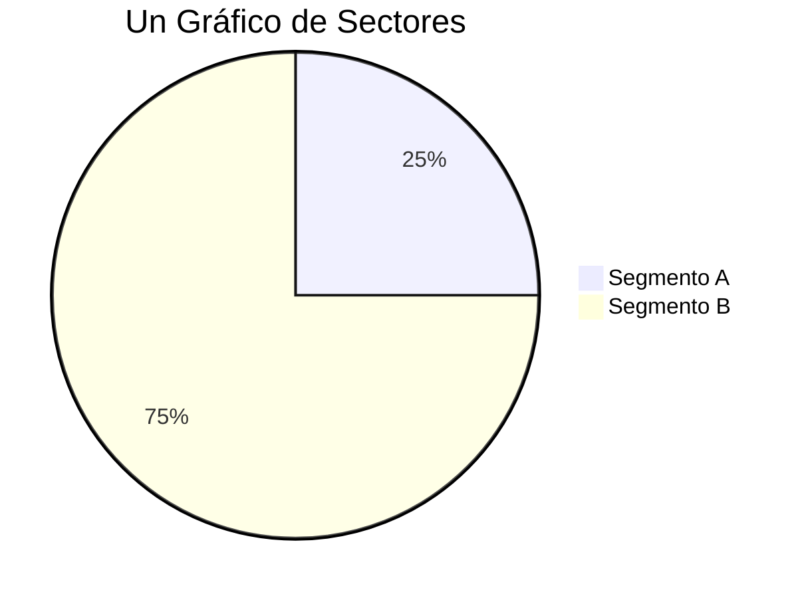
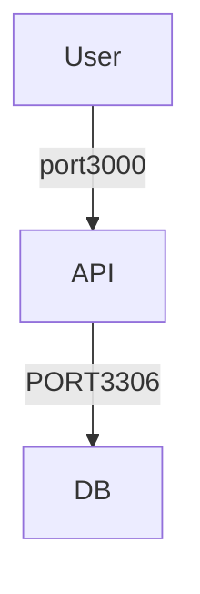
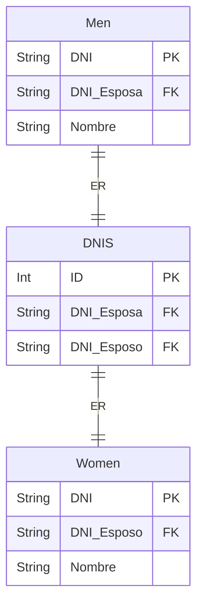

# Hola
## Sección

## Occidente

## Oriente 
:::mermaid
erDiagram
Men {
String DNI PK
String DNI_Esposa FK
String Nombre
}
Women {
String DNI PK
String DNI_Esposo FK
String Nombre
}
Men |o--o{ Women: ER
:::

