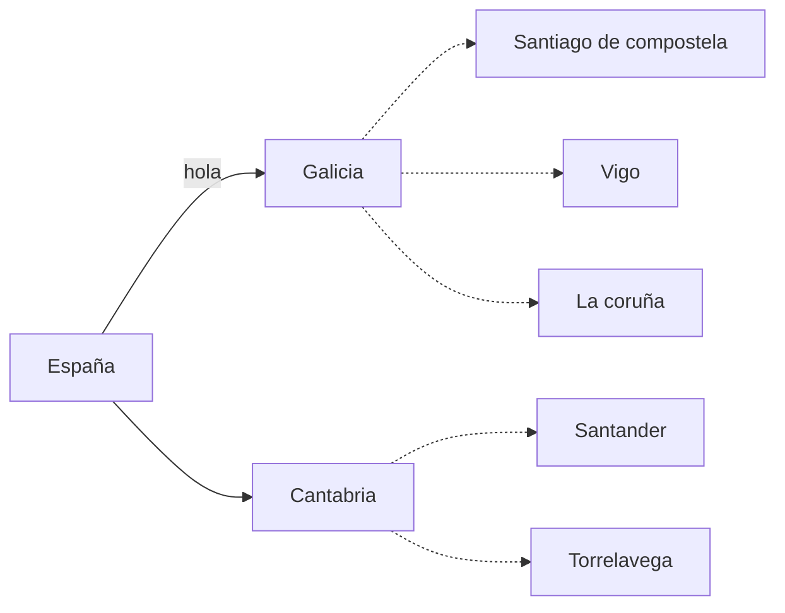
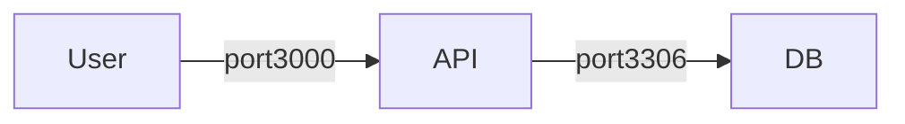

# Hola
Texto cualquiera

## Sección
Ejemplo de texto

``` mermaid
graph LR
España --hola-->Galicia -.-> 1[Santiago de compostela]
Galicia -.-> Vigo
Galicia -.-> 2[La coruña]
España -->Cantabria -.-> Santander
Cantabria -.-> Torrelavega
``` 

``` mermaid
graph LR
User --port3000--> API--port3306--> DB

``` 

```mermaid
